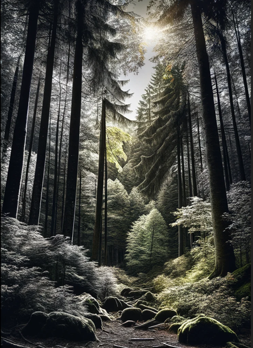

# Resumo sobre Filtros em Processamento de Imagem
O objetivo de um filtro em processamento de imagem é modificar a imagem de entrada de maneira a realçar características específicas, atenuar ruídos, ou prepará-la para análises e operações subsequentes. Filtros podem alterar a escala de cores, destacar contornos, remover imperfeições, ou combinar informações de várias imagens, contribuindo significativamente para a análise e interpretação de dados visuais.

### `1. Transformação em escala de cinza`

- ___Objetivo:___ Converter uma imagem colorida em tons de cinza, reduzindo a complexidade e enfatizando a intensidade luminosa.
- ___Exemplo:___ Uma fotografia colorida que, após processamento, exibe somente variações de cinza, realçando texturas e formas.
#### `2. Detecção de borda (Sobel)`

- ___Objetivo:___ Destacar as bordas de objetos na imagem, facilitando a identificação de contornos e formas.
- ___Exemplo:___ Uma imagem de paisagem onde o filtro Sobel é aplicado para destacar as linhas das montanhas e edifícios.
#### `3. Binarização`

- ___Objetivo:___ Transformar a imagem em preto e branco, onde os pixels são convertidos em 0 ou 1 (preto ou branco), facilitando a separação de elementos.
- ___Exemplo:___ Uma imagem de texto convertida para binarização, onde as letras ficam em preto e o fundo em branco, realçando a legibilidade.
#### `4. Filtro de média`

- ___Objetivo:___ Suavizar a imagem, reduzindo ruídos e variações de intensidade, por meio da média dos valores de pixels vizinhos.
- ___Exemplo:___ Uma fotografia com ruído que, após aplicação do filtro de média, apresenta uma aparência mais suave e uniforme.
#### `5. Filtro de moda`

- ___Objetivo:___ Reduzir ruídos aplicando o valor mais frequente dos pixels vizinhos a cada ponto da imagem.
- ___Exemplo:___ Imagem com artefatos de cor que se tornam menos visíveis após o filtro de moda, resultando em uma imagem mais homogênea.
#### `6. Filtro Gaussiano`

- ___Objetivo:___ Suavizar a imagem utilizando uma função Gaussiana para calcular a média dos pixels, eficaz na redução de ruído mantendo bordas relativamente nítidas.
- ___Exemplo:___ Uma imagem de retrato que, após o filtro Gaussiano, mostra uma pele mais lisa e uniforme, com ruídos minimizados.
#### `7. Soma de duas imagens`

- ___Objetivo:___ Combinar duas imagens diferentes, somando os valores de pixels correspondentes para criar uma sobreposição ou realçar características.
- ___Exemplo:___ A sobreposição de uma imagem transparente de um mapa em cima de uma fotografia de terreno, realçando a geografia.
#### `8. Multiplicação de duas imagens`

- ___Objetivo:___ Multiplicar os valores de pixels de duas imagens, intensificando ou modificando características quando as imagens têm áreas de interesse comuns.
- ___Exemplo:___ Multiplicação de uma imagem de iluminação com a cena original para intensificar o efeito de iluminação.
#### `9. Divisão de duas imagens`

    </img>
    </img>

#### À esquerda, tem uma imagem natural, e à direita, a mesma cena após passar pelos seguintes processamentos de imagem: transformação em escala de cinza, detecção de borda (Sobel), filtro Gaussiano e binarização.