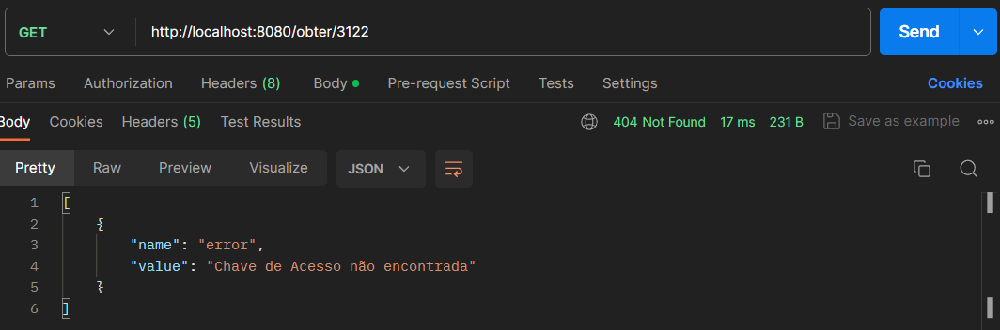
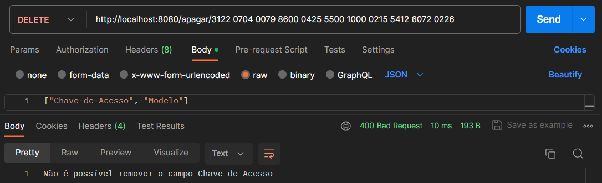

# Dados NFe
## Descrição do Projeto
O projeto Dados NFe foi concebido no âmbito da disciplina de Programação Orientada a Objetos na Universidade São Francisco (USF). Seu propósito é facilitar o armazenamento e manipulação de dados de Nota Fiscal Eletrônica (NFe) enquanto o servidor estiver em execução. Destinado a clientes que lidam com uma considerável quantidade de informações, a aplicação proporciona a disponibilidade dos dados de NFe para comparação e manipulação.
### Funcionalidades Principais
- `Adição de Dados:` Permite a inclusão de informações de Notas Fiscais, ampliando o banco de dados durante a execução do servidor.  
- `Manipulação de Dados:` Possibilita a manipulação dos dados armazenados, oferecendo recursos para análise e processamento eficiente.
- `Atualização e Exclusão de Dados:` Permite a atualização ou exclusão de informações de Notas Fiscais específicas, conferindo flexibilidade na gestão de dados.
- `Autenticação de Notas:` Oferece funcionalidade de autenticação para garantir a integridade e segurança das informações armazenadas.

## Desenvolvedores
### Weslley Marcelo Morais dos Santos - RA: 202106520

## Tecnologias Empregadas
- `Linguagem de Programação:` Java
- `Framework:` Spring Boot
- `Outras Dependências:` Spring Data JPA, Spring Boot Starter Web, Spring Boot Dev Tools e Spring Boot Starter Test
- `Ferramentas de Build:` Maven

## Descrição da Arquitetura
A arquitetura do projeto segue os princípios da Programação Orientada a Objetos (POO), organizando o código em classes e módulos distintos. A estrutura é composta por controladores, serviços, modelos e classes de exceção, cada um desempenhando um papel específico no funcionamento da aplicação.
### Controladores
Os controladores, localizados no pacote com.example.nfe.controller, representam a camada responsável por receber as requisições HTTP e direcioná-las para os serviços apropriados. Eles são anotados com @RestController e contêm métodos mapeados para endpoints específicos, como criar (POST), atualizar (PUT), obter (GET) e apagar (DELETE) dados relacionados às Notas Fiscais Eletrônicas.
### Serviços
A lógica de negócios e manipulação dos dados é encapsulada na camada de serviços, presente no pacote com.example.nfe.service. O serviço DadosService gerencia a lista de dados (Notas Fiscais) e oferece métodos para adicionar, obter, atualizar e apagar esses dados. Os serviços são anotados com @Service para serem corretamente identificados e injetados nos controladores.
### Modelos
Os modelos, representados pela classe NotaFiscal no pacote com.example.nfe.model, são entidades que encapsulam os dados das Notas Fiscais. Cada instância da classe contém informações sobre um único dado da Nota Fiscal, como nome e valor.
### Exceções
O tratamento de exceções é realizado através de classes específicas no pacote com.example.nfe.error. Essas classes, como ChaveDuplicadaException, ChaveNaoEncontradaException e ElementosNaoEncontradosException, estendem a classe RuntimeException, permitindo um tratamento adequado de situações excepcionais durante a execução da aplicação.
### Injeção de Dependência
A injeção de dependência é utilizada no controlador para injetar o serviço DadosService, facilitando a modularidade e testabilidade do código. A anotação @Autowired é empregada para indicar a dependência.

A arquitetura reflete uma abordagem clara e coesa da POO, onde as responsabilidades são distribuídas de acordo com os princípios de separação de interesses e coesão, resultando em um código organizado e de fácil manutenção.

## Funcionalidade
### Avaliação das Operações CRUD:
### 1. Create(POST):
- O método `receberDados` no controlador (Controller) lida com a criação de novos dados (Notas Fiscais) através do endpoint `/criar`. Ele chama o método correspondente no serviço (DadosService) para adicionar as Notas Fiscais à lista. O tratamento de exceções também está presente para lidar com situações como dados duplicados ou erros internos no servidor.

#### Descrição: Responsável por receber dados de Notas Fiscais.
#### Método HTTP: POST
#### Estrutura do JSON: Deve ser um array contendo objetos no formato `{"name": "", "value": ""}` contendo o campo de nome e valor encontrados na nota fiscal, conforme explícito no exemplo.
#### Observações: O campo `Chave de Acesso` é obrigatório, caso contrário erro vai ser retornado, confome segue o exemplo:

#### Observações: Se ao enviar um novo objeto com uma Chave de Acesso já existente, uma mensagem específica será retornada:

#### Observações: Tentar adicionar uma Nota Fiscal com o value da Chave de Acesso como null ou uma string vazia:

### 2. Read(GET):
- Existem dois endpoints para a operação de leitura:
    - `/obter:` Retorna todas as Notas Fiscais presentes na lista.
    - `/obter/{chaveAcesso}:` Retorna os dados associados a uma Nota Fiscal específica, identificada pela chave de acesso.

#### Descrição: Responsável por retornar os dados das Notas Fiscais.
#### Método HTTP: GET
#### Endpoint `/obter`: Retorna um array contendo todas as notas fiscais que foram adicionadas à lista. 
#### Endpoint `/obter/{chaveAcesso}`: Retorna apenas a nota fiscal com a Chave de Acesso passada como query string.

#### Observações: Se for passado uma Chave de Acesso como query string que não exista no armazenamento vai retornar uma mensagem de erro.

### 3. Update(PUT):
- O método `atualizarDados` no controlador (Controller) lida com a atualização de dados através do endpoint `/atualizar/{chaveAcesso}`. Ele chama o método correspondente no serviço (DadosService) para atualizar os dados existentes ou adicionar novos dados na Nota Fiscal identificada pela chave de acesso fornecida. O tratamento de exceções também está presente para lidar com situações como a chave de acesso não encontrada.
#### Descrição: Responsável por atualizar ou criar dados da Notas Fiscal.
#### Método HTTP: PUT
#### Endpoint `atualizar/{ChaveAcesso}`: Permite atualizar um novo elemento passando o name e o novo value que deseja ser atualizado, ou criar um novo dado, passando name que ainda não existe e o value que deseja, exemplo:
#### Atualizar Dados

#### Criar Dados

#### Observações: Tentar atualizar uma Nota Fiscal com uma Chave de Acesso que não existe

#### 4. Delete(DELETE):
- Existem dois endpoints para a operação de exclusão:
    - `/apagar/{chaveAcesso}:` Remove elementos específicos de uma Nota Fiscal, exceto a chave de acesso.
    - `/apagar-nota/{chaveAcesso}:` Remove completamente uma Nota Fiscal com base na chave de acesso.
#### Descrição: Responsável por apagar dados da Notas Fiscal.
#### Método HTTP: DELETE
#### Endpoint `/apagar/{ChaveAcesso}`: Apaga elementos específicos da nota fiscal passada como query string, passando um array com os names de cada objeto, exemplo:

#### Endpoint `/apagar-nota/{ChaveAesso}`: Apaga a Nota Fiscal passada como query string, exemplo:

#### Observações: Tentar apagar a Chave de Acesso de uma Nota Fiscal:

#### Observações: Nota Fiscal vazia

#### Observações: Tentar apagar uma Nota Fiscal com uma Chave de Acesso inexistente:
